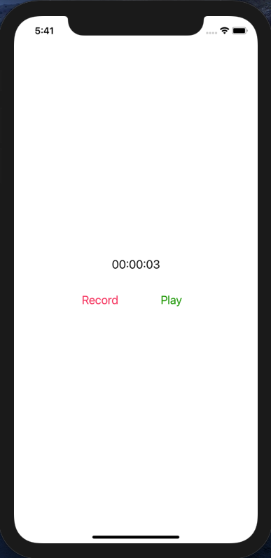

# VoiceRecorder
___
## Оглавление
- **[Описание](#Description)**
- **[Презентация](#Presentation)**
- **[В планах сделать](#ToDo)**

## Описание
Диктофон. Учебный проект.

- Проект написан на **UIKit**
- Верстка интерфейса **Storyboard**
- Сохранение записей через **FileManager**
- Фрэймворки: **AVFoundation**

___

## Презентация
### Основной экран

___

## В планах сделать:
1. Рефакторинг. Переписать под MVC, разгрузить контроллер.
2. Добавить выбор записи через CollectionView

